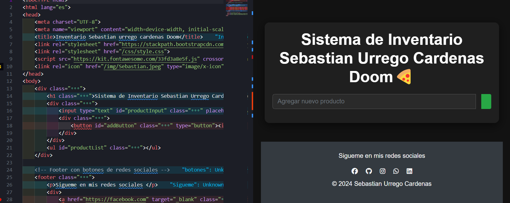

Tecnologias utilizadas 
- Libreria de bootstrap
-libreria de fontawesome

Recomendaciones
 recorda comentar para no perder el flujo de trabajo de codigo de javascrip acuerdate que estas utilizando un controlador e versiones (git)

Verificando aqui esta el link de github de la enidencia: https://github.com/CaballeroUrrego/javascrip-inventario-Vanesa-Medina/blob/main/README.md

 la pagina web:https://unrivaled-donut-c5372a.netlify.app/

1:31 /28/11/2024 los trabajos que pidio en html estan afuera de la carpeta junto a sus conexiones esto se hizo por comodidades
